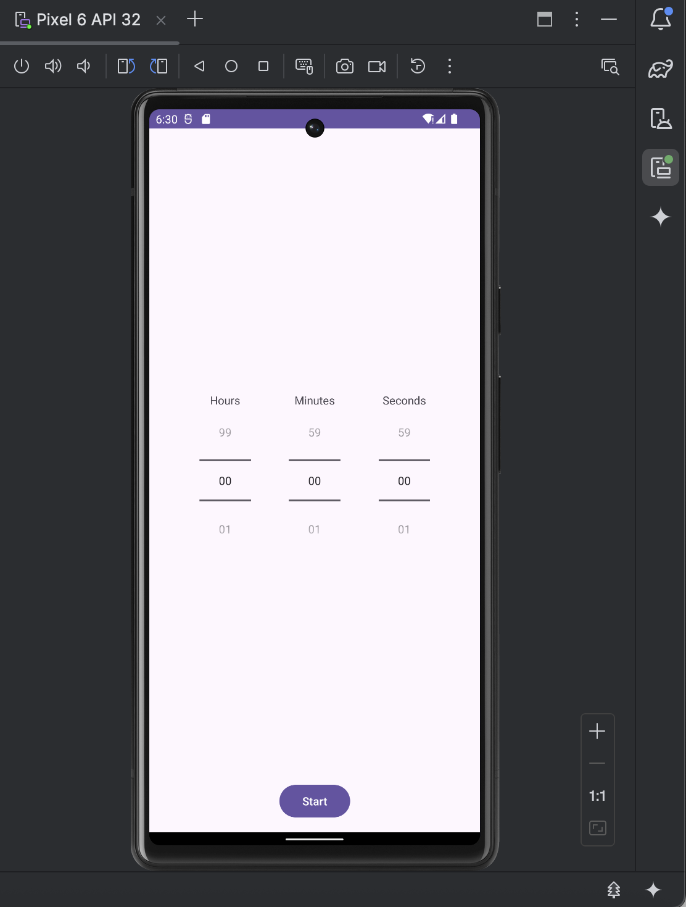
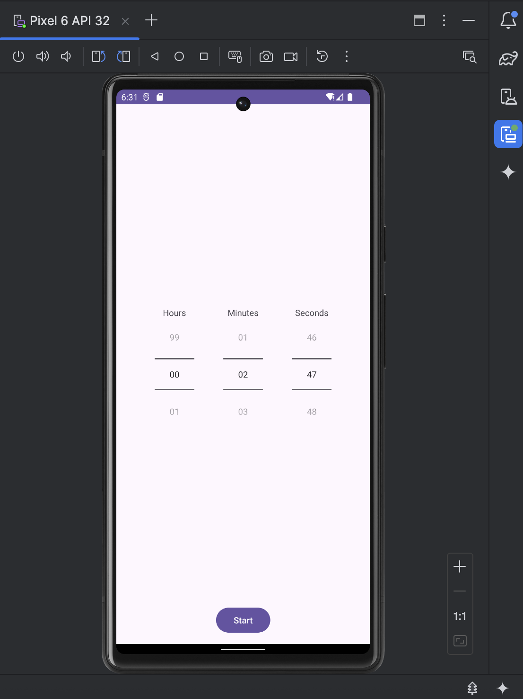
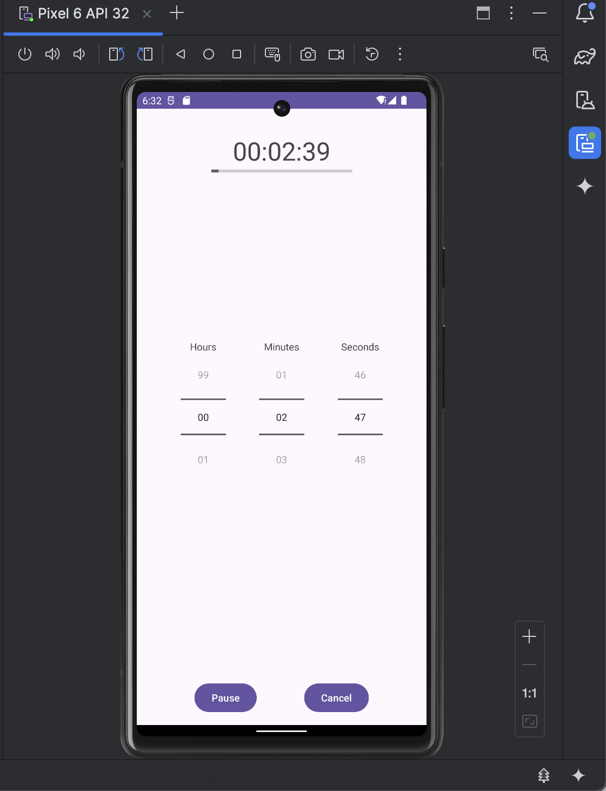
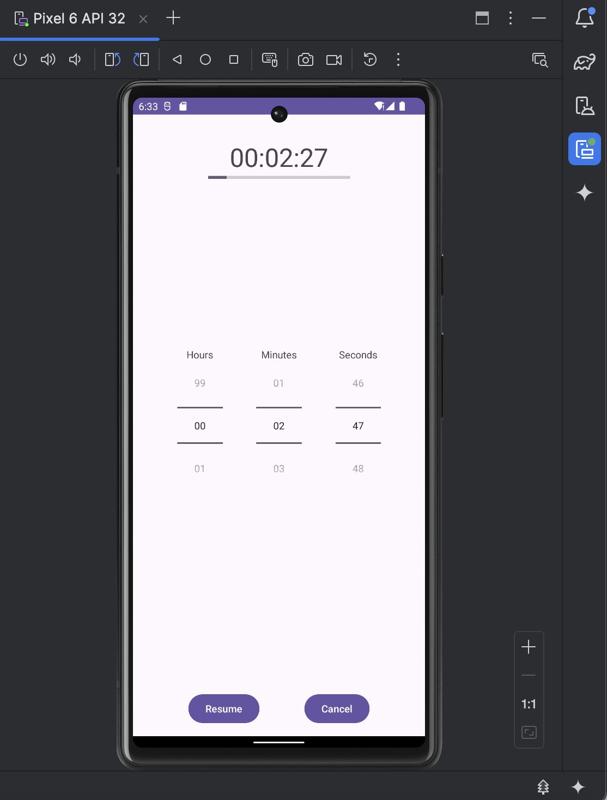
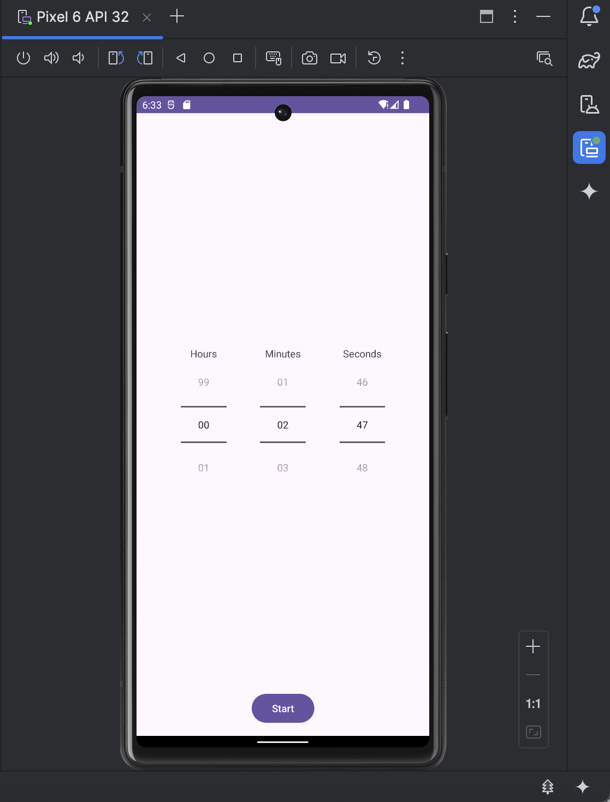

# ⏱️ Timer App

A simple and clean countdown timer application that allows the user to select hours, minutes, and seconds using NumberPickers and start a timer with progress tracking.  
The timer supports **pause**, **resume**, and **cancel** actions and continues running in the background using **WorkManager**, sending notifications until it finishes.

---

## 📌 Features

- Select **hours**, **minutes**, and **seconds** for the countdown  
- Start timer and track progress visually  
- Pause and resume at any moment  
- Cancel timer and reset UI  
- Background execution with **WorkManager notifications**  
- Clean UI with smooth updates using **coroutines**

---

## 📱 Screenshots

### **1. App on first load**

### **2. Setting a random time before starting**

### **3. Timer running (UI updating every second)**

### **4. After pressing the Pause button**

### **5. After pressing Cancel — timer reset**

---

## 🧠 Architecture Overview

The app consists of three main Kotlin files:

### **`MainActivity.kt`**
Handles:
- UI initialization  
- Button interactions (Start, Pause, Cancel)  
- Launching coroutines to update timer  
- Communicating with `TimerModel`  
- Scheduling background work with WorkManager  

---

### **`TimerModel.kt`**
Handles all countdown logic:
- Start, pause, resume, stop  
- Time calculations (hours/minutes/seconds left)  
- Percentage progress  
- String formatting of remaining time  

This class contains **no UI code**, making it clean and testable.

---

### **`TimerWorker.kt`**
Runs timer countdown in background when the app is not visible:
- Shows notifications every second  
- Uses WorkManager  
- Displays a final notification when the timer finishes  

---

## ▶️ How to Use

1. Select hours, minutes, and seconds  
2. Press **Start**  
3. Watch the countdown and progress bar update  
4. Press **Pause** to temporarily stop  
5. Press **Resume** to continue  
6. Press **Cancel** to reset the timer  
7. If you leave the app, notifications continue updating  

---

## 🛠️ Technologies Used

- Kotlin  
- Android Views (NumberPicker, ProgressBar, Buttons)  
- Coroutines for UI updates  
- WorkManager for background processing  
- MVVM-inspired separation (Model + Activity UI logic)

---
